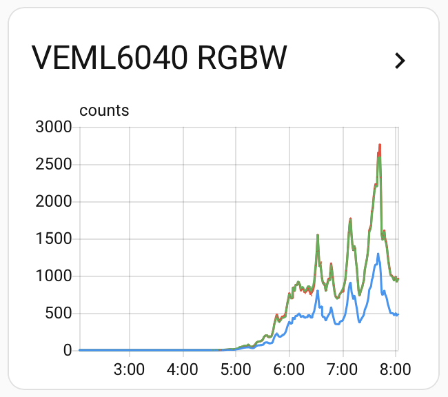

# VEML6040 RGBW Ambient Light Sensor

ESPHome external component for the **Vishay VEML6040 RGBW ambient light sensor**.

The component supports both the raw sensor channels and derived measurements such as illuminance (lux) and correlated color temperature (CCT).

---

## Features

- Red channel
- Green channel
- Blue channel
- White channel
- Illuminance (lux)
- Configurable integration time
- Lux compensation factor
- Estimated correlated color temperature (CCT)
- Custom calibration matrix for CCT



---

## Installation

Add the external component repository:

```yaml
external_components:
  - source: github://kzd76/esphome-components
    components: [veml6040]
```

---

## Example configuration

```yaml
esphome:
  name: veml6040-demo

esp32:
  board: esp32dev

logger:

api:

ota:
  - platform: esphome

wifi:
  ssid: "YOUR_WIFI_SSID"
  password: "YOUR_WIFI_PASSWORD"

i2c:
  sda: GPIO6
  scl: GPIO7
  scan: true

external_components:
  - source: github://kzd76/esphome-components
    components: [veml6040]

sensor:
  - platform: veml6040
    integration_time: 40ms
    lux_compensation: 1.0

    red:
      name: "Red"

    green:
      name: "Green"

    blue:
      name: "Blue"

    white:
      name: "White"

    illuminance:
      name: "Illuminance"

    color_temperature:
      name: "Color Temperature"
      cct_profile: open_air
```

---

## Configuration options

### integration_time

Integration time used by the sensor.

Supported values:

- `40ms`
- `80ms`
- `160ms`
- `320ms`
- `640ms`
- `1280ms`

Default:

```yaml
integration_time: 40ms
```

---

### lux_compensation

Compensation factor applied to the calculated illuminance.

Example:

```yaml
lux_compensation: 1.15
```

Default:

```yaml
lux_compensation: 1.0
```

---

### color_temperature

Optional correlated color temperature sensor.

Supported profiles:

| Profile | Description |
|----------|-------------|
| `open_air` | Vishay typical open-air matrix |
| `room_4k` | Vishay typical 4000K indoor matrix |
| `calibrated` | User supplied calibration matrix |

Example:

```yaml
color_temperature:
  name: "Color Temperature"
  cct_profile: open_air
```

---

## Notes

### Illuminance

The lux value is calculated from the green channel using the Vishay application note.

### Color temperature

The estimated CCT uses the Vishay reference conversion matrix.

For highest accuracy, use a calibrated matrix generated for your own sensor module and optical setup.

### Raw RGBW values

Raw channels are published as ADC counts and can be used for custom calculations or diagnostics.

---

## Tested with

- ESPHome 2026.6.x
- ESP-IDF framework
- ESP32-C6
- Vishay VEML6040

---

## License

MIT
